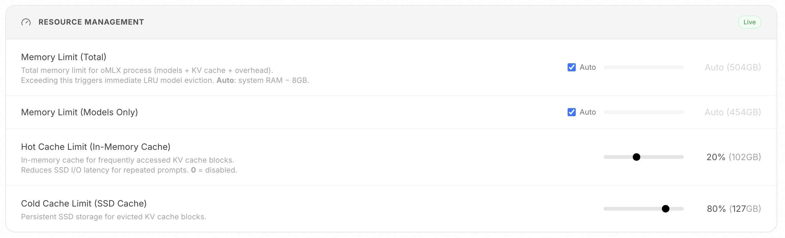
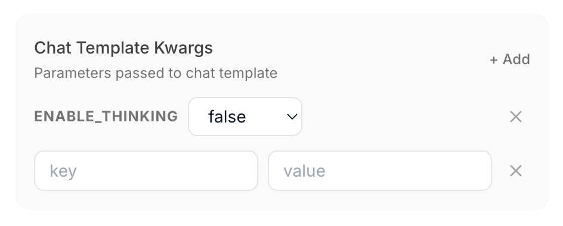
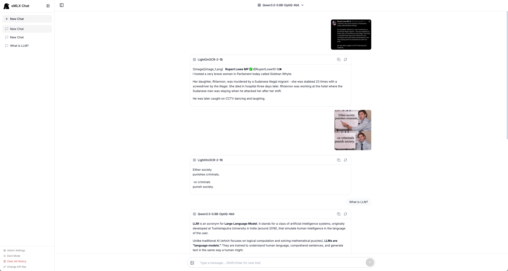
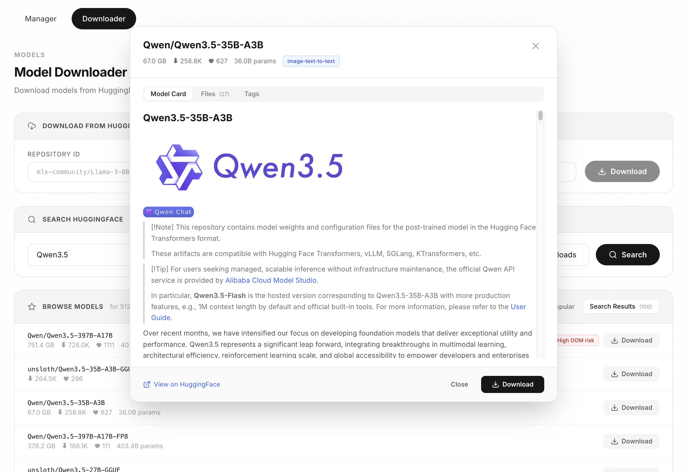
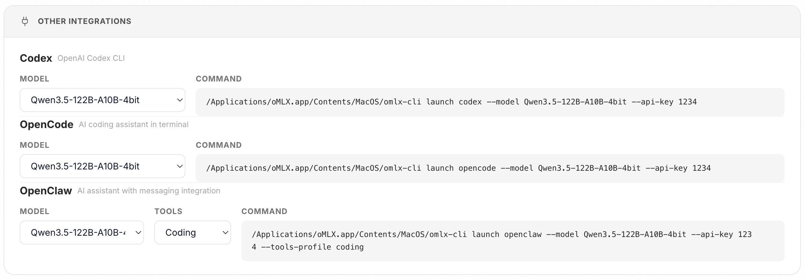
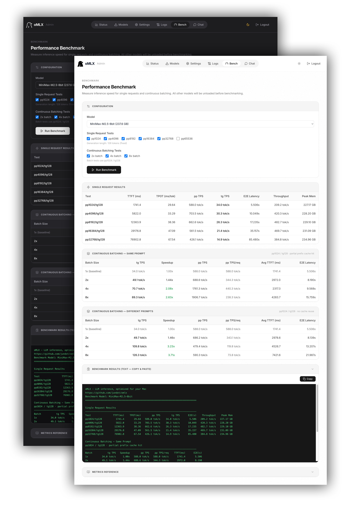

<p align="center">
  <picture>
    <source media="(prefers-color-scheme: dark)" srcset="docs/images/icon-rounded-dark.svg" width="140">
    <source media="(prefers-color-scheme: light)" srcset="docs/images/icon-rounded-light.svg" width="140">
    
  </picture>
</p>

<h1 align="center">oMLX</h1>
<p align="center"><b>Wnioskowanie LLM, zoptymalizowane pod Twojego Maca</b><br>Ciągłe batchowanie i warstwowy cache KV, zarządzane bezpośrednio z paska menu.</p>

<p align="center">
<a href="https://www.buymeacoffee.com/jundot"></a>
</p>

<p align="center">
  
  
  
</p>

<p align="center">
  <a href="mailto:junkim.dot@gmail.com">junkim.dot@gmail.com</a> · <a href="https://omlx.ai/me">https://omlx.ai/me</a>
</p>

<p align="center">
  <a href="#instalacja">Instalacja</a> ·
  <a href="#szybki-start">Szybki start</a> ·
  <a href="#funkcje">Funkcje</a> ·
  <a href="#modele">Modele</a> ·
  <a href="#konfiguracja-cli">Konfiguracja CLI</a> ·
  <a href="https://omlx.ai/benchmarks">Benchmarki</a> ·
  <a href="https://omlx.ai">oMLX.ai</a>
</p>

<p align="center">
  <a href="README.md">English</a> ·
  <a href="README.zh.md">中文</a> ·
  <a href="README.ko.md">한국어</a> ·
  <a href="README.ja.md">日本語</a> ·
  <b>Polski</b>
</p>

---

<p align="center">
  
</p>

> *Każdy serwer LLM, który wypróbowałem, zmuszał mnie do wyboru między wygodą a kontrolą. Chciałem przypinać codzienne modele w pamięci, automatycznie podmieniać cięższe na żądanie, ustawiać limity kontekstu — i zarządzać tym wszystkim z paska menu.*
>
> *oMLX przechowuje cache KV w gorącej warstwie pamięci i zimnej warstwie SSD — nawet gdy kontekst zmienia się w trakcie rozmowy, cały wcześniejszy kontekst zostaje w cache i nadaje się do ponownego użycia między żądaniami, dzięki czemu lokalne LLM stają się praktyczne do prawdziwej pracy programistycznej z narzędziami pokroju Claude Code. Dlatego to zbudowałem.*

## Instalacja

### Aplikacja macOS

Pobierz `.dmg` ze strony [Releases](https://github.com/jundot/omlx/releases), przeciągnij do Applications, gotowe. Aplikacja ma wbudowaną auto-aktualizację, więc kolejne aktualizacje to jedno kliknięcie. Aplikacja macOS instaluje też lekką nakładkę CLI `~/.omlx/bin/omlx`, dzięki czemu komendy terminala i Skróty Apple mogą sterować serwerem zarządzanym przez aplikację.

### Homebrew

```bash
brew tap jundot/omlx https://github.com/jundot/omlx
brew install jundot/omlx/omlx

# Aktualizacja do najnowszej wersji
brew update && brew upgrade omlx

# Uruchomienie jako usługa w tle (automatyczny restart po awarii)
omlx start

# Opcjonalnie: obsługa MCP (Model Context Protocol)
/opt/homebrew/opt/omlx/libexec/bin/pip install mcp
```

Opcjonalne natywne kernele dla GLM-5.2 / MiniMax M3 wymagają obecnie kompilacji HEAD:

```bash
brew install jundot/omlx/omlx --HEAD --with-custom-kernel
```

### Ze źródeł

```bash
git clone https://github.com/jundot/omlx.git
cd omlx
pip install -e .          # Tylko rdzeń
pip install -e ".[mcp]"   # Z obsługą MCP (Model Context Protocol)

# Natywne kernele dla GLM-5.2 / MiniMax M3 / Qwen3.5 (zdecydowanie zalecane,
# jeśli serwujesz te rodziny modeli — patrz uwaga poniżej)
OMLX_WITH_CUSTOM_KERNEL=1 pip install -e .
```

Wymaga macOS 15.0+ (Sequoia), Pythona 3.11–3.13 oraz Apple Silicon (M1/M2/M3/M4/M5).

> **Uwaga o natywnych kernelach:** zwykłe `pip install -e .` ich NIE kompiluje,
> a affected rodziny modeli po cichu przechodzą wtedy na dużo wolniejsze
> ścieżki generyczne — dla GLM-5.2 sfuzowany prefill DSA jest z kernelami około
> 30x szybszy (zmierzono 845 vs ~29 tok/s na M3 Ultra), a wersja zapasowa zużywa
> też więcej pamięci (#2137). Kompilacja wymaga toolchaina Metal, którego same
> Command Line Tools nie dostarczają (`xcrun: error: unable to find utility
> "metal"`): zainstaluj pełny Xcode albo użyj oficjalnego DMG, który zawiera
> kernele już skompilowane. Homebrew potrafi je zbudować poleceniem
> `brew install jundot/omlx/omlx --HEAD --with-custom-kernel`, ale ta kompilacja
> również wymaga pełnego Xcode. Weryfikacja instalacji:
>
> ```bash
> python -c "from omlx.custom_kernels import native_kernel_status; print(native_kernel_status())"
> ```

## Szybki start

### Aplikacja macOS

Uruchom oMLX z folderu Applications. Ekran powitalny prowadzi przez trzy kroki — katalog modeli, start serwera i pobranie pierwszego modelu. Tyle. Żeby podłączyć OpenClaw, OpenCode, Codex, Hermes Agent, Copilot albo DeepSeek Harness, zobacz [Integracje](#integracje).

<p align="center">
  
  
</p>

### CLI

```bash
# Zarządzany serwer w tle (aplikacja macOS lub instalacja Homebrew)
omlx start
omlx stop
omlx restart

# Serwer na pierwszym planie, podpięty do tego terminala
omlx serve --model-dir ~/models
```

Serwer sam wykrywa LLM, VLM, modele embedding i rerankery w podkatalogach. Każdy klient zgodny z OpenAI połączy się pod `http://localhost:8000/v1`. Wbudowany czat jest też dostępny pod `http://localhost:8000/admin/chat`.

### Usługa Homebrew

Jeśli zainstalowałeś przez Homebrew, możesz uruchomić oMLX jako zarządzaną usługę w tle:

```bash
omlx start                    # Start przez brew services
omlx stop                     # Stop
omlx restart                  # Restart

brew services start omlx    # Start (automatyczny restart po awarii)
brew services stop omlx     # Stop
brew services restart omlx  # Restart
brew services info omlx     # Sprawdź status
```

Usługa uruchamia `omlx serve` z domyślną konfiguracją bez ustawień (`~/.omlx/models`, port 8000). `omlx start`, `omlx stop` i `omlx restart` to przenośne komendy cyklu życia; instalacje Homebrew delegują je do `brew services`. Żeby dostosować, ustaw zmienne środowiskowe (`OMLX_MODEL_DIR`, `OMLX_PORT` itd.) albo raz uruchom `omlx serve --model-dir /twoja/sciezka`, co zapisze ustawienia w `~/.omlx/settings.json`.

Logi zapisywane są w dwóch miejscach:

- **Log usługi**: `$(brew --prefix)/var/log/omlx.log` (stdout/stderr)
- **Log serwera**: `~/.omlx/logs/server.log` (strukturalny log aplikacji)

## Funkcje

Obsługuje tekstowe LLM, modele wizyjno-językowe (VLM), modele OCR, embeddingi i rerankery na Apple Silicon.

### Panel administracyjny

Interfejs webowy pod `/admin` do monitoringu w czasie rzeczywistym, zarządzania modelami, czatu, benchmarków i ustawień per model. Obsługuje angielski, koreański, japoński, chiński, francuski, rosyjski, hiszpański, brazylijski portugalski i polski. Wszystkie zależności CDN są dołączone lokalnie, więc działa w pełni offline.

<p align="center">
  
</p>

### Eksperymentalne wnioskowanie na wiele Maków

Kompilacje ze źródeł potrafią podzielić jeden pobrany model językowy na Maki o różnej pamięci, używając rang potokowych MLX po Ring lub Thunderbolt RDMA/JACCL. Panel Cluster obsługuje wykrywanie peerów tylko do odczytu, ścisłą weryfikację SSH/runtime, planowanie shardów z uwzględnieniem bajtów przy nierównych pamięciach, mierzone równoważenie obciążenia obliczeń/łącza, strojenie wykonania ze świadomością zapasu, aktywację oraz żywą mapę shardów/wydajności na obu Makach. Profile interaktywny, zrównoważony i przepływnościowy udostępniają sklejone batchowanie, powinowactwo cache promptów, limity rotującego-KV, strojenie połączeń Ring oraz eksperymentalną ścieżkę wyjścia tylko-tokenową z bramką capability. Zobacz [Wnioskowanie rozproszone na Maki](docs/distributed-cluster.md) — konfiguracja, granice bezpieczeństwa, aktualne ograniczenia i lista kontrolna walidacji na fizycznym sprzęcie.

### Modele wizyjno-językowe

Uruchamiaj VLM na tym samym stosie ciągłego batchowania i warstwowego cache KV co tekstowe LLM. Obsługuje czat wieloobrazkowy, wejścia obrazkowe base64/URL/plik oraz tool calling z kontekstem wizyjnym. Checkpointy MiMo V2.6 z dołączonymi sidecarami przyjmują też wideo z próbkowanymi klatkami i audio 24 kHz. Konwersja oQ oficjalnych checkpointów MiMo V2.6 zachowuje obsługę obrazu i dźwięku. Modele OCR (DeepSeek-OCR, DOTS-OCR, GLM-OCR) wykrywane są automatycznie, ze zoptymalizowanymi promptami.

### Warstwowy cache KV (gorący + zimny)

Zarządzanie cache KV w blokach, inspirowane vLLM, ze współdzieleniem prefiksów i Copy-on-Write. Cache działa na dwóch warstwach:

- **Warstwa gorąca (RAM)**: często używane bloki zostają w pamięci dla szybkiego dostępu.
- **Warstwa zimna (SSD)**: gdy gorący cache się zapełni, bloki lądują na SSD w formacie safetensors. Przy kolejnym żądaniu z pasującym prefiksem są odtwarzane z dysku zamiast liczone od zera — nawet po restarcie serwera.

<p align="center">
  
</p>

### Ciągłe batchowanie

Obsługuje współbieżne żądania przez BatchGenerator z mlx-lm. Maksymalną liczbę współbieżnych żądań ustawisz przez CLI albo panel admina.

### Optymalizacja pod Claude Code

Uruchamia modele o mniejszym kontekście z Claude Code, raportując prawdziwe okno kontekstu modelu do auto-kompaktowania zamiast skalowania liczby tokenów, a SSE keep-alive zapobiega timeoutom odczytu podczas długiego prefill.

### Serwowanie wielu modeli

Ładuj LLM, VLM, modele embedding i rerankery na tym samym serwerze. Modelami zarządza kombinacja mechanizmów automatycznych i ręcznych:

- **Eksmisja LRU**: najrzadziej używane modele są automatycznie wyładowywane, gdy brakuje pamięci.
- **Ręczne ładowanie/wyładowywanie**: interaktywne plakietki statusu w panelu admina pozwalają ładować i wyładowywać modele na żądanie.
- **Przypinanie modeli**: przypnij często używane modele, żeby zawsze były załadowane.
- **TTL per model**: ustaw czas bezczynności per model, po którym wyładuje się automatycznie.
- **Egzekwowanie limitu pamięci procesu**: łączny limit pamięci (domyślnie: RAM systemu − 8 GB) chroni przed systemowym OOM.

### Ustawienia per model

Parametry próbkowania, kwargs szablonu czatu, TTL, alias modelu, nadpisanie typu modelu i więcej — wszystko per model, bezpośrednio z panelu admina. Zmiany działają od razu, bez restartu serwera.

- **Alias modelu**: ustaw własną nazwę widoczną w API. `/v1/models` zwraca alias, a żądania akceptują zarówno alias, jak i nazwę katalogu.
- **Nadpisanie typu modelu**: ręcznie ustaw model jako LLM albo VLM, niezależnie od auto-wykrywania.
- **Profile**: zapisuj nazwane pakiety ustawień per model i przełączaj je z panelu admina. Profil można opcjonalnie wystawić jako osobny model: `/v1/models` listuje wtedy też `<model>:<profil>` (np. `qwen3-8b:thinking`), który serwuje na tym samym silniku co model bazowy, z ustawieniami profilu nakładanymi per żądanie — bez dodatkowej pamięci i bez przeładowania. Gdy model bazowy ma alias, wystawione ID ogłaszane jest jako `<alias>:<profil>`; forma z nazwą katalogu nadal działa, tak jak dla modelu bazowego.

<p align="center">
  
</p>

### Wbudowany czat

Czatuj z dowolnym załadowanym modelem bezpośrednio z panelu admina. Obsługuje historię rozmów, przełączanie modeli, tryb ciemny, wyjście modeli rozumujących i wgrywanie obrazów dla modeli VLM/OCR.

<p align="center">
  
</p>


### Pobieranie modeli

Wyszukuj i pobieraj modele MLX z HuggingFace bezpośrednio w panelu admina. Przeglądaj karty modeli, sprawdzaj rozmiary plików i pobieraj jednym klikiem.

<p align="center">
  
</p>

### Integracje

Skonfiguruj OpenClaw, OpenCode, Codex, Hermes Agent, Copilot, Pi i DeepSeek Harness bezpośrednio z panelu admina, jednym kliknięciem. Bez ręcznej edycji konfiguracji.

<p align="center">
  
</p>

### Benchmark wydajności

Benchmark jednym klikiem z panelu admina. Mierzy prefill (PP) i generowanie tekstu (TG) w tokenach na sekundę, z testem częściowych trafień cache prefiksów dla realistycznych wyników.

<p align="center">
  
</p>

### Aplikacja w pasku menu macOS

Natywnie aplikacja paska menu w Swift / SwiftUI (nie Electron). Uruchamiaj, zatrzymuj i monitoruj serwer bez otwierania terminala. Zawiera [lokalną historię użycia](docs/usage-analytics.md) z sumami per model i mapą cieplną godzin, trwałe statystyki serwowania (przeżywają restarty), auto-restart po awarii i wbudowaną auto-aktualizację.

<p align="center">
  
</p>

### Zgodność API

Zamiennik API OpenAI i Anthropic typu drop-in. Obsługuje strumieniowe statystyki użycia (`stream_options.include_usage`), adaptacyjne myślenie Anthropic oraz wejścia wizyjne (base64, URL).

| Endpoint | Opis |
|----------|------|
| `POST /v1/chat/completions` | Uzupełnianie czatu (strumieniowe) |
| `POST /v1/completions` | Uzupełnianie tekstu (strumieniowe) |
| `POST /v1/messages` | API Anthropic Messages |
| `POST /v1/embeddings` | Embeddingi tekstu |
| `POST /v1/rerank` | Reranking dokumentów |
| `GET /v1/models` | Lista dostępnych modeli |

### Tool calling i wyjście strukturalne

Obsługuje wszystkie formaty wywołań funkcji z mlx-lm, walidację schematów JSON i integrację narzędzi MCP. Tool calling wymaga, żeby szablon czatu modelu obsługiwał parametr `tools`. Następujące rodziny modeli wykrywane są automatycznie:

| Rodzina modeli | Format |
|---|---|
| Llama, Qwen, DeepSeek itd. | JSON `<tool_call>` |
| Seria Qwen3.5 | XML `<function=...>` |
| Gemma | `<start_function_call>` |
| GLM (4.7, 5) | XML `<arg_key>/<arg_value>` |
| MiniMax | Przestrzenne `<minimax:tool_call>` |
| Mistral | `[TOOL_CALLS]` |
| IFM K2 Horizon | XML albo JSON w `<ifm\|tool_calls>`. Wymaga `omlx[grammar]` |
| Kimi K2 | `<\|tool_calls_section_begin\|>` |
| Longcat | `<longcat_tool_call>` |

Modele spoza listy też mogą działać, jeśli ich szablon czatu akceptuje `tools`, a wyjście używa rozpoznawalnego formatu XML `<tool_call>`. Przy strumieniowaniu z narzędziami tekst asystenta emitowany jest przyrostowo, znane znaczniki sterujące tool-call są ukrywane z widocznej treści, a strukturalne wywołania narzędzi emitowane są po sparsowaniu ukończonej tury.

## Modele

Wskaż `--model-dir` na katalog z podkatalogami modeli w formacie MLX. Obsługiwane są też dwupoziomowe foldery organizacyjne (np. `mlx-community/nazwa-modelu/`).

```
~/models/
├── Step-3.5-Flash-8bit/
├── Qwen3-Coder-Next-8bit/
├── gpt-oss-120b-MXFP4-Q8/
├── Qwen3.5-122B-A10B-4bit/
└── bge-m3/
```

Modele wykrywane są automatycznie po typie. Możesz też pobierać modele bezpośrednio z panelu admina.

| Typ | Modele |
|------|--------|
| LLM | Każdy model obsługiwany przez [mlx-lm](https://github.com/ml-explore/mlx-lm) |
| VLM | Seria Qwen3.5, GLM-4V, Pixtral i inne modele [mlx-vlm](https://github.com/Blaizzy/mlx-vlm) |
| OCR | DeepSeek-OCR, DOTS-OCR, GLM-OCR |
| Embedding | BERT, BGE-M3, ModernBERT |
| Reranker | ModernBERT, XLM-RoBERTa |

## Konfiguracja CLI

```bash
# Zarządzany serwer w tle (aplikacja macOS lub instalacja Homebrew)
omlx start
omlx stop
omlx restart

# Start z domyślnymi ustawieniami (tier strażnika pamięci = balanced, zarządzenie przez UI admina)
omlx serve --model-dir ~/models

# Wybierz tier strażnika pamięci na starcie
omlx serve --model-dir ~/models --memory-guard safe

# Ustaw własny sufit strażnika pamięci w GB
omlx serve --model-dir ~/models --memory-guard-gb 48

# Włącz cache SSD dla bloków KV
omlx serve --model-dir ~/models --paged-ssd-cache-dir ~/.omlx/cache

# Ustaw rozmiar gorącego cache w pamięci
omlx serve --model-dir ~/models --hot-cache-max-size 20%

# Dostosuj maksymalną liczbę współbieżnych żądań (domyślnie: 8)
omlx serve --model-dir ~/models --max-concurrent-requests 16

# Z narzędziami MCP
omlx serve --model-dir ~/models --mcp-config mcp.json

# Lustrzany endpoint HuggingFace (dla regionów z ograniczeniami)
omlx serve --model-dir ~/models --hf-endpoint https://hf-mirror.com

# Uwierzytelnianie kluczem API
omlx serve --model-dir ~/models --api-key twoj-tajny-klucz
# Tylko-localhost: pomijanie weryfikacji przez ustawienia globalne panelu admina

# Dostęp sieciowy wymaga uwierzytelnienia
OMLX_API_KEY=twoj-tajny-klucz omlx serve --model-dir ~/models --host 0.0.0.0
```

Domyślny limit cache SSD, `auto`, zużywa 50% sumy wolnego miejsca na dysku i istniejących plików cache SSD, wliczając sidecary GDN. Budżet odświeżany jest w trakcie użycia i nie kurczy się tylko dlatego, że cache rośnie albo serwer się restartuje. Inne zużycie dysku może zmienić budżet. Ustaw `--paged-ssd-cache-max-size 20GB` dla sztywnego limitu.

Większość ustawień skonfigurujesz też z panelu admina pod `/admin`. Ustawienia zapisywane są w `~/.omlx/settings.json`, a flagi CLI mają pierwszeństwo. Ustaw główny klucz API zanim zmienisz host serwera na adres LAN albo `0.0.0.0`, albo zapisz oba ustawienia naraz. oMLX odmawia startu na dowolnym adresie innym niż loopback bez głównego klucza API. Istniejąca opcja `skip_api_key_verification` nadal działa tylko dla bindowań loopback.

Dla wnioskowania bez klucza zatrzymaj oMLX, ręcznie ustaw `auth.allow_unauthenticated_inference` na `true` w `settings.json` i zrestartuj. Domyślnie jest `false` i nie ma przełącznika w UI. Pozwala to każdemu, kto dosięgnie serwer, używać wnioskowania (w tym zapisanych Responses i audio), narzędzi MCP i wyszukiwarki web. Przy bindowaniach sieciowych zostaw skonfigurowany główny klucz API i `skip_api_key_verification` na `false`; endpointy zarządcze nadal wymagają uwierzytelnienia.

<details>
<summary>Architektura</summary>

```
FastAPI Server (OpenAI / Anthropic API)
    │
    ├── EnginePool (wiele modeli, eksmisja LRU, TTL, ręczne ładowanie/wyładowywanie)
    │   ├── BatchedEngine (LLM, ciągłe batchowanie)
    │   ├── VLMEngine (modele wizyjno-językowe)
    │   ├── EmbeddingEngine
    │   └── RerankerEngine
    │
    ├── ProcessMemoryEnforcer (łączny limit pamięci, kontrole TTL)
    │
    ├── Scheduler (FCFS, konfigurowalna współbieżność)
    │   └── mlx-lm BatchGenerator
    │
    └── Stos cache
        ├── PagedCacheManager (GPU, blokowy, CoW, współdzielenie prefiksów)
        ├── Hot Cache (warstwa w pamięci, write-back)
        └── PagedSSDCacheManager (zimna warstwa SSD, format safetensors)
```

</details>

## Development

### Serwer CLI

```bash
git clone https://github.com/jundot/omlx.git
cd omlx
pip install -e ".[dev]"
pytest -m "not slow"
```

### Aplikacja macOS

Natywnie aplikacja SwiftUI mieszka w `apps/omlx-mac/`. Wymaga Xcode 26.5+ i Pythona 3.11+. venvstacks jest zadeklarowany jako zależność deweloperska, więc `pip install -e ".[dev]"` (albo `uv sync --dev`) dociąga przypiętą wersję. Skrypt budujący wraca też do `uvx venvstacks` albo `pipx run venvstacks`, jeśli wolisz narzędzie globalne hosta.

```bash
# Przygotuj uruchamialne oMLX.app (xcodebuild + warstwy Pythona venvstacks + podpis ad-hoc)
apps/omlx-mac/Scripts/build.sh release

# Wynik ląduje w apps/omlx-mac/build/Stage/oMLX.app
open apps/omlx-mac/build/Stage/oMLX.app

# Wymuś świeżą przebudowę venvstacks (inaczej cache po fingerprint)
apps/omlx-mac/Scripts/build.sh release --rebuild-donor

# Przygotuj z opcjonalnymi natywnymi kernelami GLM-5.2 / MiniMax M3
apps/omlx-mac/Scripts/build.sh release --with-custom-kernel
```

Pierwsza kompilacja na zimno trwa 10–20 minut (montowanie warstwy Pythona venvstacks). Kolejne kompilacje używają cache `packaging/_export/` i kończą się w około 4 minuty. Zobacz [packaging/README.md](packaging/README.md) po konfigurację warstw i [apps/omlx-mac/](apps/omlx-mac/) po źródła Swift.

## Współtworzenie

Wkład mile widziany! Zobacz [przewodnik współtworzenia](docs/CONTRIBUTING.md).

- Poprawki błędów i usprawnienia
- Optymalizacje wydajności
- Usprawnienia dokumentacji

## Licencja

[Apache 2.0](LICENSE)

## Podziękowania

- [MLX](https://github.com/ml-explore/mlx) i [mlx-lm](https://github.com/ml-explore/mlx-lm) od Apple
- [mlx-vlm](https://github.com/Blaizzy/mlx-vlm) — wnioskowanie modeli wizyjno-językowych na Apple Silicon
- [vllm-mlx](https://github.com/waybarrios/vllm-mlx) — oMLX wystartował z vllm-mlx v0.1.0 i mocno urósł: serwowanie wielu modeli, warstwowy cache KV, VLM z pełną obsługą stronicowanego cache, panel admina i aplikacja paska menu macOS
- [venvstacks](https://venvstacks.lmstudio.ai) — przenośne warstwowanie środowisk Pythona dla paczki aplikacji macOS
- [mlx-embeddings](https://github.com/Blaizzy/mlx-embeddings) — obsługa modeli embedding na Apple Silicon
- [dflash-mlx](https://github.com/bstnxbt/dflash-mlx) — blokowe dyfuzyjne dekodowanie spekulatywne na Apple Silicon
- [MTPLX](https://github.com/youssofal/mtplx) — kernele Metal weryfikacji kształtu Lightning MTP napędzane przez MTPLX od Youssofa Altoukhiego, który zainspirował też potok depth-k
- [mlx-serve](https://github.com/ddalcu/mlx-serve) — sfuzowany kernel GDN verify prework zaadaptowany z portu mlx-serve kernela qwen35_packed_gdn_prework z wyzwania mlxfast, a sfuzowane kernele dekodowania i prefill GDN dla Qwen4 zaadaptowane z `transformer.zig` mlx-serve na licencji MIT; 128-bitowe staging K/V w Qwen4 QSA zaadaptowane z `msv_attn_p256` mlx-serve na licencji MIT
- [Splash](https://github.com/incoai/splash) — kernele liniowe weryfikacji kształtu używają operandu wag bf16 `0x4300 | q` z sumami wejść per grupa (z Apache-2.0 `linear_q4_sgmatrix.metal` Splash), a uwaga weryfikacyjna operacji tensorowych adaptuje projekt kafelków z `paged_attention_tile.h` Splash
- [SiliconScope](https://github.com/kennss/SiliconScope) — statystyki paska menu czerpią projekt i podejście renderowania z SiliconScope od Kennta Kima, który zainspirował też energooszczędne bramkowanie przerysowań
