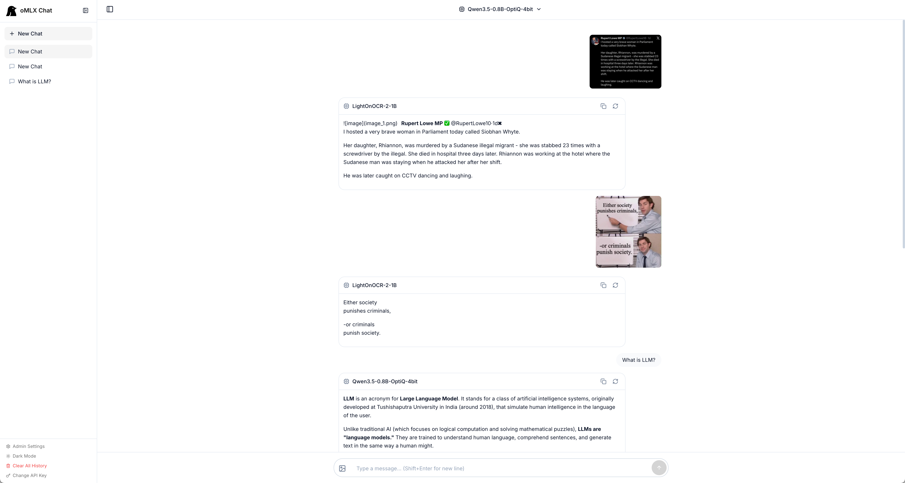
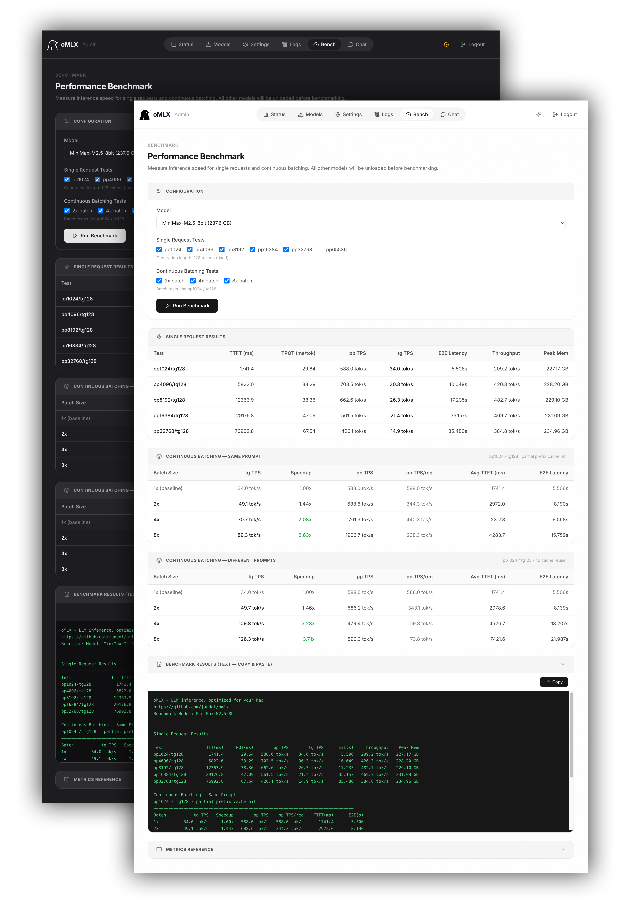

<p align="center">
  <picture>
    <source media="(prefers-color-scheme: dark)" srcset="docs/images/icon-rounded-dark.svg" width="140">
    <source media="(prefers-color-scheme: light)" srcset="docs/images/icon-rounded-light.svg" width="140">
    
  </picture>
</p>

<h1 align="center">oMLX</h1>
<p align="center"><b>LLM-инференс, оптимизированный для вашего Mac</b><br>Непрерывный batching и многоуровневый KV-кэш, управляемые прямо из строки меню.</p>

<p align="center">
<a href="https://www.buymeacoffee.com/jundot"></a>
</p>

<p align="center">
  
  
  
</p>

<p align="center">
  <a href="mailto:junkim.dot@gmail.com">junkim.dot@gmail.com</a> · <a href="https://omlx.ai/me">https://omlx.ai/me</a>
</p>

<p align="center">
  <a href="#установка">Установка</a> ·
  <a href="#быстрый-старт">Быстрый старт</a> ·
  <a href="#возможности">Возможности</a> ·
  <a href="#модели">Модели</a> ·
  <a href="#конфигурация-cli">Конфигурация CLI</a> ·
  <a href="https://omlx.ai/benchmarks">Бенчмарки</a> ·
  <a href="https://omlx.ai">oMLX.ai</a>
</p>

<p align="center">
  <a href="README.md">English</a> ·
  <a href="README.zh.md">中文</a> ·
  <a href="README.ko.md">한국어</a> ·
  <a href="README.ja.md">日本語</a> ·
  <b>Русский</b>
</p>

---

<p align="center">
  
</p>

> *Все LLM-серверы, которые я пробовал, заставляли выбирать между удобством и контролем. Я хотел закреплять повседневные модели в памяти, автоматически подменять более тяжёлые по запросу, задавать лимиты контекста и управлять всем этим из строки меню.*
>
> *oMLX сохраняет KV-кэш в двух слоях: горячем in-memory и холодном SSD. Даже если контекст меняется в середине диалога, весь прошлый контекст остаётся закэшированным и может переиспользоваться между запросами. Это делает локальные LLM реально удобными для серьёзной работы, например с Claude Code. Поэтому я и сделал этот проект.*

## Установка

### macOS App

Скачайте `.dmg` из [Releases](https://github.com/jundot/omlx/releases), перетащите приложение в Applications, и готово. В приложении есть встроенное автообновление, так что последующие обновления занимают один клик. Учтите, что macOS-версия не устанавливает CLI-команду `omlx`. Для использования в терминале ставьте через Homebrew или из исходников.

### Homebrew

```bash
brew tap jundot/omlx https://github.com/jundot/omlx
brew install omlx

# Обновиться до последней версии
brew update && brew upgrade omlx

# Запустить как фоновый сервис (авторестарт при падении)
brew services start omlx

# Опционально: поддержка MCP (Model Context Protocol)
/opt/homebrew/opt/omlx/libexec/bin/pip install mcp
```

### Из исходников

```bash
git clone https://github.com/jundot/omlx.git
cd omlx
pip install -e .          # Только core
pip install -e ".[mcp]"   # С поддержкой MCP (Model Context Protocol)
```

Требуются macOS 15.0+ (Sequoia), Python 3.10+ и Apple Silicon (M1/M2/M3/M4).

## Быстрый старт

### macOS App

Запустите oMLX из папки Applications. Экран приветствия проведёт вас через три шага: каталог моделей, запуск сервера и первая загрузка модели. На этом всё. Чтобы подключить OpenClaw, OpenCode или Codex, см. [Интеграции](#интеграции).

<p align="center">
  
  
</p>

### CLI

```bash
omlx serve --model-dir ~/models
```

Сервер автоматически обнаруживает LLM, VLM, embedding-модели и reranker'ы в подкаталогах. Любой OpenAI-совместимый клиент может подключиться к `http://localhost:8000/v1`. Встроенный чат-интерфейс также доступен на `http://localhost:8000/admin/chat`.

### Сервис Homebrew

Если вы установили oMLX через Homebrew, его можно запускать как управляемый фоновый сервис:

```bash
brew services start omlx    # Запуск (авторестарт при падении)
brew services stop omlx     # Остановка
brew services restart omlx  # Перезапуск
brew services info omlx     # Проверка статуса
```

Сервис запускает `omlx serve` с настройками по умолчанию (`~/.omlx/models`, порт 8000). Для настройки используйте переменные окружения (`OMLX_MODEL_DIR`, `OMLX_PORT` и т. д.) либо один раз запустите `omlx serve --model-dir /your/path`, чтобы сохранить параметры в `~/.omlx/settings.json`.

Логи пишутся в два места:
- **Лог сервиса**: `$(brew --prefix)/var/log/omlx.log` (stdout/stderr)
- **Лог сервера**: `~/.omlx/logs/server.log` (структурированный application log)

## Возможности

Поддерживает текстовые LLM, vision-language модели (VLM), OCR-модели, embeddings и rerankers на Apple Silicon.

### Панель управления

Web UI по адресу `/admin` для мониторинга в реальном времени, управления моделями, чата, бенчмарков и настроек по каждой модели. Поддерживаются English, Korean, Japanese, Chinese и Russian. Все CDN-зависимости вендоризованы, так что полностью офлайн-работа поддерживается из коробки.

<p align="center">
  
</p>

### Vision-Language модели

Запускайте VLM на том же стеке непрерывного batching и многоуровневого KV-кэша, что и текстовые LLM. Поддерживаются multi-image chat, ввод изображений через base64/URL/файлы и tool calling с визуальным контекстом. OCR-модели (DeepSeek-OCR, DOTS-OCR, GLM-OCR) определяются автоматически и используют оптимизированные подсказки.

### Многоуровневый KV-кэш: горячий + холодный

Блочно-ориентированное управление KV-кэшем, вдохновлённое vLLM, с разделением префиксов и Copy-on-Write. Кэш работает в двух слоях:

- **Горячий слой (RAM)**: часто используемые блоки остаются в памяти для быстрого доступа.
- **Холодный слой (SSD)**: когда горячий кэш переполняется, блоки выгружаются на SSD в формате safetensors. При следующем запросе с совпадающим префиксом они восстанавливаются с диска вместо повторного вычисления - даже после рестарта сервера.

<p align="center">
  
</p>

### Непрерывный batching

Обрабатывает параллельные запросы через BatchGenerator из mlx-lm. Максимальное число одновременных запросов настраивается через CLI или панель управления.

### Оптимизация для Claude Code

Поддерживается scaling контекста для запуска меньших контекстных моделей в Claude Code. Масштабирование отчётных token counts позволяет auto-compact срабатывать в нужный момент, а SSE keep-alive предотвращает timeout при долгом prefill.

### Мульти-модельный сервер

LLM, VLM, embedding-модели и rerankers можно загружать в одном сервере. Управление моделями строится на комбинации автоматических и ручных механизмов:

- **LRU-выгрузка**: наименее используемые модели автоматически выгружаются при нехватке памяти.
- **Ручная загрузка/выгрузка**: интерактивные badges в панели управления позволяют загружать и выгружать модели по запросу.
- **Pinning моделей**: часто используемые модели можно закрепить, чтобы они всегда оставались загруженными.
- **TTL для моделей**: для каждой модели можно задать тайм-аут простоя, после которого она выгружается автоматически.
- **Ограничение памяти процесса**: общий лимит памяти (по умолчанию: RAM системы минус 8 GB) предотвращает системный OOM.

### Настройки по моделям

С панели управления можно прямо задавать параметры сэмплинга, chat template kwargs, TTL, model alias, override типа модели и многое другое. Изменения применяются сразу, без перезапуска сервера.

- **Псевдоним модели**: задайте пользовательское имя для API. `/v1/models` будет возвращать alias, а запросы будут принимать и alias, и имя каталога.
- **Override типа модели**: можно вручную пометить модель как LLM или VLM, независимо от автоопределения.

<p align="center">
  
</p>

### Встроенный чат

Общайтесь с любой загруженной моделью прямо из панели управления. Поддерживаются история диалога, переключение моделей, тёмная тема, вывод reasoning-моделей и загрузка изображений для VLM/OCR.

<p align="center">
  
</p>

### Загрузчик моделей

Ищите и скачивайте MLX-модели с HuggingFace прямо из панели управления. Можно просматривать карточки моделей, проверять размеры файлов и скачивать их одним кликом.

<p align="center">
  
</p>

### Интеграции

Настраивайте OpenClaw, OpenCode, Codex и Pi прямо из панели управления одним кликом. Ручное редактирование конфигураций не требуется.

<p align="center">
  
</p>

### Бенчмарк производительности

Запускайте бенчмарки одним кликом из панели управления. Измеряются tokens per second для prefill (PP) и генерации текста (TG), а также тестируется частичное попадание в prefix cache для реалистичной картины производительности.

<p align="center">
  
</p>

### Приложение для меню macOS

Нативное PyObjC-приложение для строки меню, не Electron. Позволяет запускать, останавливать и мониторить сервер без открытия терминала. Есть постоянная статистика сервиса, авторестарт при сбое и встроенное автообновление.

<p align="center">
  
</p>

### Совместимость с API

Готовая замена для OpenAI и Anthropic API. Поддерживаются streaming usage stats (`stream_options.include_usage`), adaptive thinking Anthropic и vision-inputs (base64, URL).

| Endpoint | Описание |
|----------|----------|
| `POST /v1/chat/completions` | Chat completions (streaming) |
| `POST /v1/completions` | Text completions (streaming) |
| `POST /v1/messages` | Anthropic Messages API |
| `POST /v1/embeddings` | Текстовые embeddings |
| `POST /v1/rerank` | Ранжирование документов |
| `GET /v1/models` | Список доступных моделей |

### Tool Calling и структурированный вывод

Поддерживаются все форматы function calling, которые есть в mlx-lm, JSON Schema validation и интеграция MCP tools. Для tool calling chat template модели должен поддерживать параметр `tools`. Следующие семейства моделей автоматически распознаются встроенными парсерами mlx-lm:

| Семейство моделей | Формат |
|---|---|
| Llama, Qwen, DeepSeek и др. | JSON `<tool_call>` |
| Qwen3.5 Series | XML `<function=...>` |
| Gemma | `<start_function_call>` |
| GLM (4.7, 5) | XML `<arg_key>/<arg_value>` |
| MiniMax | Namespaced `<minimax:tool_call>` |
| Mistral | `[TOOL_CALLS]` |
| Kimi K2 | `<\|tool_calls_section_begin\|>` |
| Longcat | `<longcat_tool_call>` |

Модели, которых нет в списке выше, тоже могут работать, если их chat template принимает `tools`, а вывод использует распознаваемый XML-формат `<tool_call>`. Для stream-запросов с tool support текст ассистента отправляется постепенно, а управляющие маркеры tool-call скрываются из видимого контента; структурированные tool calls отправляются после полного разбора завершённого ответа.

## Модели

Укажите `--model-dir` на каталог, содержащий подкаталоги с моделями в формате MLX. Поддерживается и двухуровневая организация (например, `mlx-community/model-name/`).

```
~/models/
├── Step-3.5-Flash-8bit/
├── Qwen3-Coder-Next-8bit/
├── gpt-oss-120b-MXFP4-Q8/
├── Qwen3.5-122B-A10B-4bit/
└── bge-m3/
```

Модели автоматически определяются по типу. Их также можно скачивать прямо из панели управления.

| Тип | Модели |
|------|--------|
| LLM | Любые модели, поддерживаемые [mlx-lm](https://github.com/ml-explore/mlx-lm) |
| VLM | Серия Qwen3.5, GLM-4V, Pixtral и другие модели [mlx-vlm](https://github.com/Blaizzy/mlx-vlm) |
| OCR | DeepSeek-OCR, DOTS-OCR, GLM-OCR |
| Embedding | BERT, BGE-M3, ModernBERT |
| Reranker | ModernBERT, XLM-RoBERTa |

## Конфигурация CLI

```bash
# Лимит памяти для загруженных моделей
omlx serve --model-dir ~/models --max-model-memory 32GB

# Лимит памяти на уровне процесса (по умолчанию: auto = RAM - 8GB)
omlx serve --model-dir ~/models --max-process-memory 80%

# Включить SSD-кэш для KV-блоков
omlx serve --model-dir ~/models --paged-ssd-cache-dir ~/.omlx/cache

# Задать размер горячего кэша в памяти
omlx serve --model-dir ~/models --hot-cache-max-size 20%

# Изменить максимальное число одновременных запросов (по умолчанию: 8)
omlx serve --model-dir ~/models --max-concurrent-requests 16

# С MCP tools
omlx serve --model-dir ~/models --mcp-config mcp.json

# Endpoint зеркала HuggingFace (для ограниченных регионов)
omlx serve --model-dir ~/models --hf-endpoint https://hf-mirror.com

# Аутентификация по API-ключу
omlx serve --model-dir ~/models --api-key your-secret-key
# Только localhost: можно пропустить проверку через глобальные настройки в панели управления
```

Все параметры также можно настроить в веб-панели управления `/admin`. Настройки сохраняются в `~/.omlx/settings.json`, а CLI-флаги имеют приоритет.

<details>
<summary>Архитектура</summary>

```
FastAPI Server (OpenAI / Anthropic API)
    │
    ├── EnginePool (multi-model, LRU eviction, TTL, manual load/unload)
    │   ├── BatchedEngine (LLM, continuous batching)
    │   ├── VLMEngine (vision-language models)
    │   ├── EmbeddingEngine
    │   └── RerankerEngine
    │
    ├── ProcessMemoryEnforcer (общий лимит памяти, проверка TTL)
    │
    ├── Scheduler (FCFS, настраиваемая параллельность)
    │   └── mlx-lm BatchGenerator
    │
    └── Cache Stack
        ├── PagedCacheManager (GPU, блочная организация, CoW, разделение префиксов)
        ├── Hot Cache (in-memory tier, write-back)
        └── PagedSSDCacheManager (SSD cold tier, формат safetensors)
```

</details>

## Разработка

### CLI Server

```bash
git clone https://github.com/jundot/omlx.git
cd omlx
pip install -e ".[dev]"
pytest -m "not slow"
```

### macOS App

Требуются Python 3.11+ и [venvstacks](https://venvstacks.lmstudio.ai) (`pip install venvstacks`).

```bash
cd packaging

# Полная сборка (venvstacks + app bundle + DMG)
python build.py

# Пропустить venvstacks (только изменения кода)
python build.py --skip-venv

# Только DMG
python build.py --dmg-only
```

Смотрите [packaging/README.md](packaging/README.md) для деталей о структуре app bundle и конфигурации слоёв.

## Вклад

Вклад приветствуется! Подробности см. в [руководстве для контрибьюторов](docs/CONTRIBUTING.md).

- Исправления багов и улучшения
- Оптимизация производительности
- Улучшение документации

## Лицензия

[Apache 2.0](LICENSE)

## Благодарности

- [MLX](https://github.com/ml-explore/mlx) и [mlx-lm](https://github.com/ml-explore/mlx-lm) от Apple
- [mlx-vlm](https://github.com/Blaizzy/mlx-vlm) - inference vision-language моделей на Apple Silicon
- [vllm-mlx](https://github.com/waybarrios/vllm-mlx) - oMLX начинался как vllm-mlx v0.1.0 и затем сильно эволюционировал: появились multi-model serving, tiered KV caching, VLM с полной поддержкой paged cache, admin panel и macOS menu bar app
- [venvstacks](https://venvstacks.lmstudio.ai) - многослойная портируемая Python-среда для macOS app bundle
- [mlx-embeddings](https://github.com/Blaizzy/mlx-embeddings) - поддержка embedding-моделей на Apple Silicon
- [dflash-mlx](https://github.com/bstnxbt/dflash-mlx) - block diffusion speculative decoding на Apple Silicon
